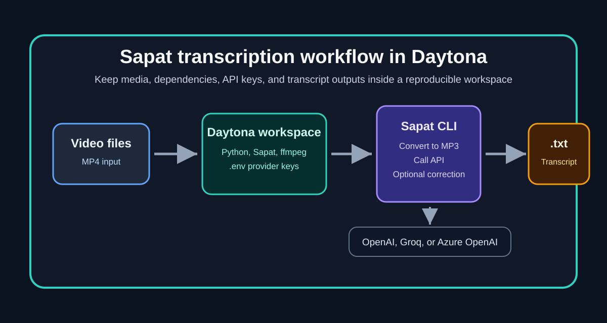

# Transcribe Videos with Sapat in Daytona

# Introduction

Video transcription looks simple until it becomes part of a repeatable developer workflow. One engineer may have `ffmpeg` installed globally, another may be missing Python build tooling, and a third may have API keys configured for a different provider.

Those small environment differences slow down AI teams that need to turn demos, lectures, product walkthroughs, or research recordings into usable text.

[Sapat](https://github.com/nkkko/sapat) is a Python command line tool for [speech-to-text](../definitions/20260510_definition_speech_to_text.md) workflows. It converts video files to MP3 with `ffmpeg`, sends the audio to a transcription provider, and writes the transcript next to the original video.

At the time of writing, the project includes adapters for OpenAI, Groq, and Azure OpenAI. It can process a single video file or every `.mp4` file in a directory.

This guide shows how to run Sapat inside a [Daytona](https://www.daytona.io/) workspace so the setup is reproducible, portable, and easier to hand off to another engineer.

You will create the workspace, configure provider credentials, install the package, run transcriptions, optionally correct transcripts with a chat model, and troubleshoot the most common failure modes.



## TL;DR

- Sapat turns video files into `.txt` transcripts by converting them to MP3 and sending the audio to OpenAI, Groq, or Azure OpenAI.
- Daytona keeps Python, `ffmpeg`, credentials, and test media inside one reproducible workspace.
- Use `sapat ./video.mp4 --api groq` for a single file, or point Sapat at a directory to process all `.mp4` files inside it.
- Keep `.env` private. Store only `.env.example` in source control.
- Choose Groq for fast Whisper-style transcription, OpenAI for broad API familiarity, and Azure OpenAI when your organization already standardizes on Azure deployments.

## Prerequisites

You need the following before starting:

- A Daytona account and the Daytona CLI installed locally.
- Python knowledge at the level of installing packages and running CLI commands.
- API access to at least one supported transcription provider: OpenAI, Groq, or Azure OpenAI.
- One short `.mp4` file for testing. Start with a file under a few minutes so iteration is fast.
- Basic familiarity with environment variables and `.env` files.

Sapat also depends on `ffmpeg`. You can install it manually in the workspace, or add it to the workspace setup so every new workspace receives the same media tooling.

## Step 1: Create the Daytona workspace

Start from the Sapat repository:

```bash
daytona create https://github.com/nkkko/sapat --code
```

Open the workspace in your editor when Daytona finishes provisioning it. The repository layout is intentionally small:

```text
sapat/
  pyproject.toml
  README.md
  src/
    sapat/
      script.py
      transcription/
        azure.py
        base.py
        groq.py
        openai.py
```

The important files are:

| File | Purpose |
| --- | --- |
| `pyproject.toml` | Defines the `sapat` package, dependencies, and CLI entry point. |
| `src/sapat/script.py` | Defines the Click command and CLI options. |
| `src/sapat/transcription/base.py` | Converts video/audio to MP3 and writes transcript output. |
| `src/sapat/transcription/openai.py` | Sends audio to the OpenAI transcription endpoint. |
| `src/sapat/transcription/groq.py` | Sends audio to the Groq OpenAI-compatible transcription endpoint. |
| `src/sapat/transcription/azure.py` | Sends audio to an Azure OpenAI audio deployment. |

## Step 2: Install system and Python dependencies

Inside the Daytona workspace terminal, verify Python first:

```bash
python --version
pip --version
```

Install `ffmpeg` if the base image does not already include it:

```bash
sudo apt-get update
sudo apt-get install -y ffmpeg
ffmpeg -version
```

Then install Sapat in editable mode:

```bash
python -m pip install --upgrade pip
python -m pip install -e .
```

The editable install is useful during development because changes in `src/sapat` are picked up without rebuilding a wheel. Confirm that the CLI is available:

```bash
sapat --help
```

You should see options for `--language`, `--prompt`, `--temperature`, `--quality`, `--correct`, and `--api`.

## Step 3: Configure provider credentials

Create a local `.env` file in the workspace root. Do not commit this file.

```bash
touch .env
```

For OpenAI:

```text
OPENAI_API_KEY=your_openai_api_key_here
OPENAI_MODEL=whisper-1
OPENAI_API_ENDPOINT=https://api.openai.com/v1/audio/transcriptions
OPENAI_MODEL_NAME_CHAT=gpt-4o
```

For Groq:

```text
GROQCLOUD_API_KEY=your_groq_api_key_here
GROQCLOUD_MODEL=whisper-large-v3-turbo
GROQCLOUD_API_ENDPOINT=https://api.groq.com/openai/v1/audio/transcriptions
GROQCLOUD_MODEL_NAME_CHAT=llama3-8b-8192
```

For Azure OpenAI:

```text
AZURE_OPENAI_API_KEY=your_azure_api_key_here
AZURE_OPENAI_ENDPOINT=https://your-resource.openai.azure.com
AZURE_OPENAI_DEPLOYMENT_NAME_WHISPER=whisper
AZURE_OPENAI_API_VERSION_WHISPER=2024-06-01
AZURE_OPENAI_DEPLOYMENT_NAME_CHAT=gpt-4o
AZURE_OPENAI_API_VERSION_CHAT=2023-03-15-preview
```

If you are sharing this workspace setup with a team, add a committed `.env.example` with empty values and keep the real `.env` file private. This gives teammates the expected shape without exposing secrets.

## Step 4: Add a test video

Create a working directory for media:

```bash
mkdir -p media transcripts
```

Copy a small `.mp4` file into `media/`. For example:

```text
media/product-demo.mp4
```

Start with short audio. A one-minute file is enough to confirm credentials, conversion, and transcript output. Longer files are better once you know the provider and workspace are working.

## Step 5: Run a first transcription

Run Sapat with Groq:

```bash
sapat media/product-demo.mp4 --api groq --quality M --language en
```

Run the same file with OpenAI:

```bash
sapat media/product-demo.mp4 --api openai --quality M --language en
```

Run it with Azure OpenAI:

```bash
sapat media/product-demo.mp4 --api azure --quality M --language en
```

Sapat performs three actions:

1. Converts the video to an MP3 file using `ffmpeg`.
2. Sends the MP3 file to the selected transcription provider.
3. Writes a `.txt` transcript beside the original input file.

For `media/product-demo.mp4`, the transcript output is:

```text
media/product-demo.txt
```

Sapat removes the temporary MP3 after the transcript is saved, which keeps the workspace clean when processing many videos.

## Step 6: Improve accuracy with prompt and language options

The `--language` option tells the model what language to expect:

```bash
sapat media/product-demo.mp4 --api groq --language en
```

The `--prompt` option can help the transcription model with product names, acronyms, or domain vocabulary:

```bash
sapat media/product-demo.mp4 \
  --api groq \
  --language en \
  --prompt "The speaker mentions Daytona, Sapat, ffmpeg, Whisper, Groq, Azure OpenAI, and OpenAI."
```

The prompt does not replace editing, but it helps when your video contains unusual names that a generic model may spell incorrectly.

## Step 7: Use transcript correction when needed

Sapat includes a `--correct` flag. When enabled, the tool transcribes the audio, then sends the raw transcript to the configured chat model for cleanup:

```bash
sapat media/product-demo.mp4 --api openai --quality M --language en --correct
```

Use correction for rough meeting recordings, product demos with specialized terms, or interviews where punctuation matters. Skip correction when you need a raw transcript for auditing, legal review, or direct comparison between providers.

There is one practical detail to know: correction uses the chat model variables for the provider you selected. For OpenAI, configure `OPENAI_MODEL_NAME_CHAT`. For Groq, configure `GROQCLOUD_MODEL_NAME_CHAT`. For Azure OpenAI, configure the chat deployment fields.

## Step 8: Process a folder of videos

If you pass a directory instead of a single file, Sapat processes every `.mp4` file in that directory:

```bash
sapat media --api groq --quality M --language en
```

This is useful for:

- Transcribing a batch of short user interviews.
- Converting multiple product walkthroughs into searchable notes.
- Preparing text from conference clips before summarization.
- Creating rough captions for a set of tutorial videos.

For larger batches, run a small sample first. Confirm transcript quality, provider cost, and output naming before processing everything.

## Step 9: Choose the right provider

The best provider depends on your constraints:

| Provider | Good fit | Notes |
| --- | --- | --- |
| OpenAI | General-purpose workflows, familiar API conventions, teams already using OpenAI. | Sapat calls the standard audio transcription endpoint configured in `.env`. |
| Groq | Fast Whisper-style transcription and OpenAI-compatible API patterns. | A good default for quick iteration if your account is already configured. |
| Azure OpenAI | Enterprise workspaces, Azure governance, or teams with existing Azure deployments. | Requires the correct resource endpoint, deployment names, and API versions. |

If you are writing an internal tool, start with whichever provider your organization already approves. If you are experimenting, run the same short clip through two providers and compare accuracy, punctuation, and cost before committing to a larger batch.

## Step 10: Keep the workflow reproducible

Daytona helps most when the setup is not only running today, but also repeatable next week. A good production-ready Sapat workspace should include:

- A `.env.example` file with every required variable.
- A short `media/README.md` explaining where test videos should live.
- A documented provider choice for the team.
- A `requirements` or package install command that is easy to rerun.
- A note that `.env`, transcripts, and raw media should not be committed unless the content is public and intentionally shared.

You can also add a workspace setup script:

```bash
#!/usr/bin/env bash
set -euo pipefail

sudo apt-get update
sudo apt-get install -y ffmpeg
python -m pip install --upgrade pip
python -m pip install -e .
sapat --help
```

Store it as `scripts/setup-workspace.sh`, then run it whenever a new workspace is created.

## Common Issues and Troubleshooting

**Problem:** `ffmpeg: command not found`

**Solution:** Install `ffmpeg` in the Daytona workspace:

```bash
sudo apt-get update
sudo apt-get install -y ffmpeg
```

**Problem:** `sapat: command not found`

**Solution:** Install the package in editable mode from the repository root:

```bash
python -m pip install -e .
```

Then restart the terminal or run:

```bash
python -m sapat.script --help
```

**Problem:** The provider returns an authentication error.

**Solution:** Check the matching key in `.env`. For example, Groq uses `GROQCLOUD_API_KEY`, while OpenAI uses `OPENAI_API_KEY`. Also verify that `python-dotenv` is installed and that you are running the command from the repository root where `.env` exists.

**Problem:** The audio file is too large.

**Solution:** Sapat validates audio size in the provider adapters. Start by lowering MP3 quality:

```bash
sapat media/product-demo.mp4 --api openai --quality L
```

For very long videos, split the input into smaller clips before transcription.

**Problem:** The transcript misses product names.

**Solution:** Use `--prompt` to provide vocabulary:

```bash
sapat media/demo.mp4 --api groq --prompt "This recording mentions Daytona, Sapat, dev containers, and Azure OpenAI."
```

**Problem:** A directory run skips files.

**Solution:** Sapat currently looks for `.mp4` files when processing a directory. Confirm the file extension and convert other formats to `.mp4` first, or process those files one at a time after converting them.

## Conclusion

Sapat gives AI engineers a focused transcription pipeline: video in, MP3 conversion through `ffmpeg`, provider transcription, optional correction, and `.txt` output.

Daytona makes that pipeline easier to reproduce by keeping the operating system packages, Python dependencies, API configuration, and test media in one workspace.

The next step is to turn the workflow into a small team template. Add `.env.example`, document your preferred provider, keep sample videos short, and include setup commands in the workspace.

That way, anyone on the team can open the project in Daytona and get from a video file to a usable transcript without debugging local environment differences.

## References

- [Sapat repository](https://github.com/nkkko/sapat)
- [Daytona](https://www.daytona.io/)
- [OpenAI audio transcription API](https://platform.openai.com/docs/guides/speech-to-text)
- [Groq speech-to-text documentation](https://console.groq.com/docs/speech-to-text)
- [Azure OpenAI audio documentation](https://learn.microsoft.com/azure/ai-services/openai/)
- [ffmpeg documentation](https://ffmpeg.org/documentation.html)
